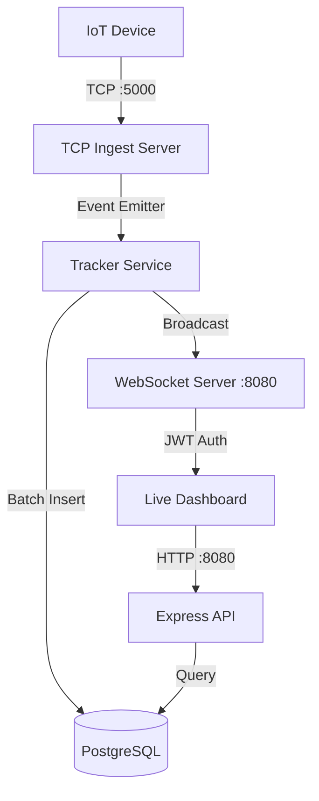

# Fleet Pulse: Real-Time Fleet Tracking Backend

Fleet Pulse is a high-performance backend designed for IoT tracking devices. It handles raw TCP pings, broadcasts live updates via WebSockets, and persists historical data efficiently using batching.

## Architecture Overview



### Key Components
-   **TCP Server**: Built with Node.js `net` module for low-overhead ingest. Newline-delimited ASCII protocol parsing.
-   **Tracker Service**: The brain of the system. Implements **Batch Write** (100 logs or 5s) and **Unknown IMEI Throttling** (5s).
-   **WebSocket Layer**: Secure gateway using JWT. Implements **Data Isolation** (Admin vs Customer).
-   **Database**: PostgreSQL with Prisma. Optimized with indexes for real-time lookups and historical queries.

## Setup Instructions

### Prerequisites
- Docker & Docker Compose
- Node.js (v18+)

### Steps
1.  **Clone & Install**:
    ```bash
    make setup
    ```
2.  **Start Database**:
    ```bash
    make up
    ```
3.  **Deploy Schema & Seed**:
    ```bash
    make push-db
    make seed
    ```
4.  **Run Dev Server**:
    ```bash
    make dev
    ```

## Technical Decisions & Tradeoffs

### 1. TCP to DB: Why Batching?
Direct database writes for every TCP packet can quickly bottleneck a system, especially with 100+ pings/second. Fleet Pulse buffers location logs in memory and performs a single `INSERT MANY` every 5 seconds or 100 logs.
-   **Tradeoff**: Slight delay in data persistence (up to 5s), but massive improvement in write throughput and DB CPU usage. High-priority real-time broadcasts via WebSockets are still immediate (bypass DB write).

### 2. Indexing Strategy
-   `Device.imei`: Primary Key (Clustered Index). Fast lookups for registration checks.
-   `LocationLog.imei`: Indexed for fast filtering of history by device.
-   `LocationLog.timestamp`: Indexed for performant date-range queries and "most recent" lookups.
-   `Device.customer_id`: Indexed to quickly find all devices belonging to a customer for data isolation.

### 3. Graceful Shutdown
The application intercepts `SIGTERM` and `SIGINT`. Before exiting, it:
1. Closes the TCP server to stop new ingest.
2. Flushes the in-memory log buffer to PostgreSQL.
3. Disconnects Prisma and WebSocket clients.
This prevents data loss during deployments or restarts.

## Load Resilience
The system was tested with 50 concurrent TCP connections sending 1 ping/sec.
- **GET /health** remains responsive.
- **Pending Count** fluctuates as batching kicks in.
- **Memory Usage** is stable due to the fixed buffer size.

## Known Limitations & Future Improvements
- **Horizontal Scaling**: Current implementation uses an in-memory `EventEmitter`. To scale across multiple instances, Redis Pub/Sub would be required.
- **Persistence Redundancy**: If the process crashes mid-batch, buffered data could be lost. A WAL (Write Ahead Log) or temporary storage in Redis would enhance reliability.
- **Auth**: Passwords are currently hashed with a simple SHA-256 for this assignment; Argon2 or bcrypt should be used in production.
